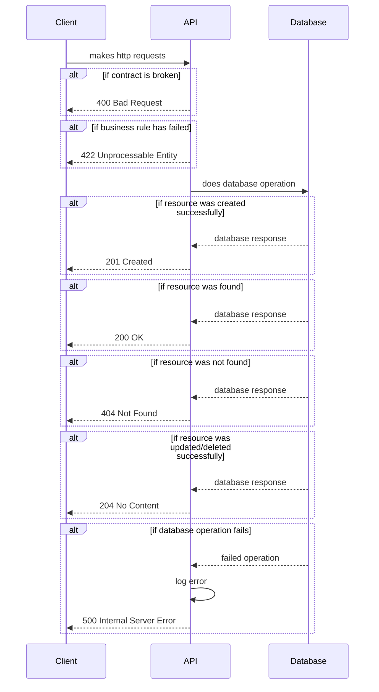

# API Conventions

## Sequence Diagram


## Success Response
```json
{
    "data": {}
}
```

## Error Response
```json
{
    "error": {
        "type": "string",
        "code": "string",
        "message": "string",
        "details": ["string"]
    }
}
```