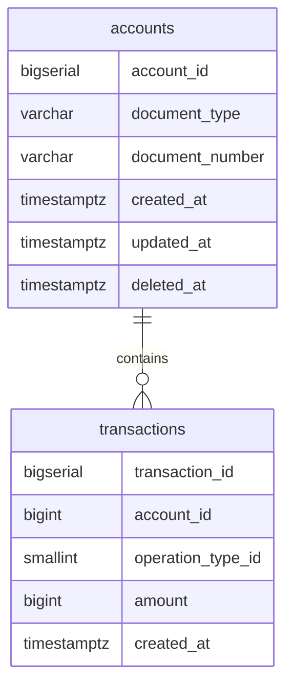

# Database ER Diagrams

```mermaid
erDiagram
    accounts ||--o{ transactions : contains
    accounts {
        bigserial account_id
        varchar document_type
        varchar document_number
        timestamptz created_at
        timestamptz updated_at
        timestamptz deleted_at
    }
    transactions {
        bigserial transaction_id
        bigint account_id
        smallint operation_type_id
        bigint amount
        timestamptz created_at
    }
```
