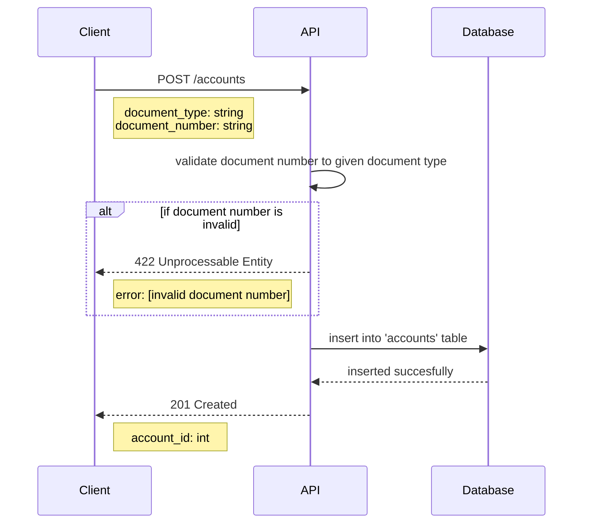

# Open Account Flow
This flow describe how an card holder (client) can open account. Each account can have many transactions associated.
## Sequence Diagram

## Requirements
* Just CPF, CNPJ and NINO document types are allowed.
* Document Type and Number are required fields