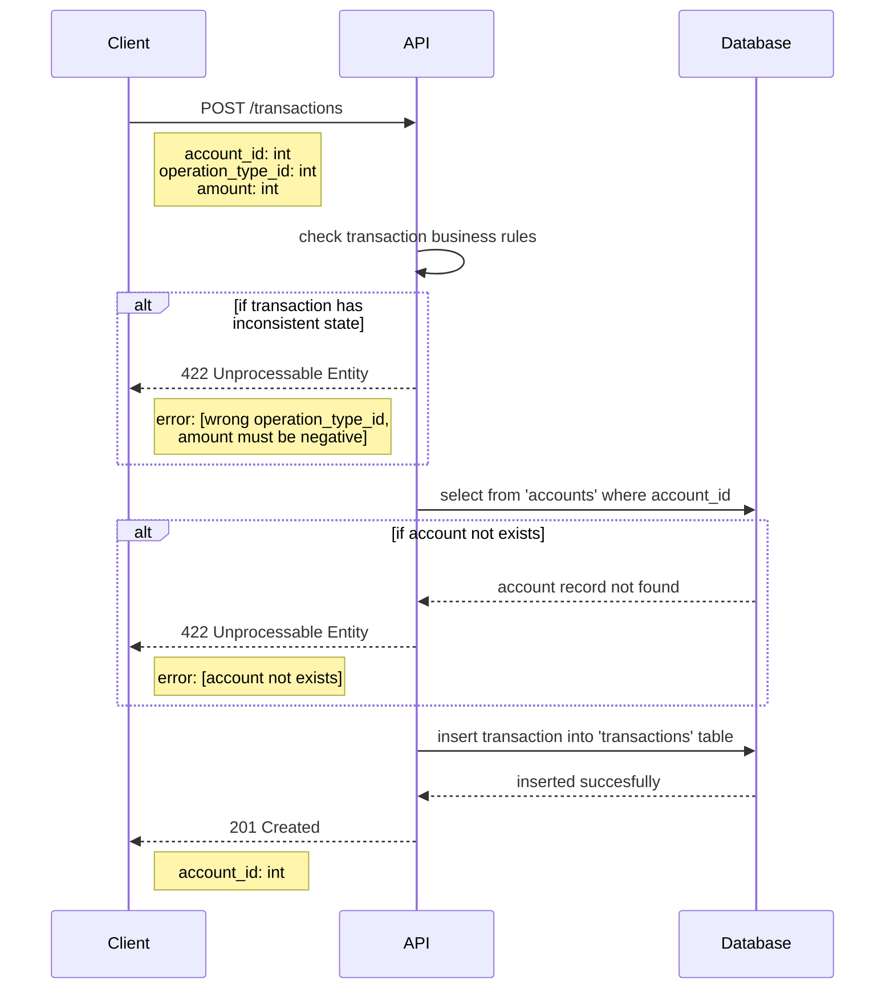

# Save Transaction Flow
This flow describe how a transaction can be saved and associated to an account. Many transactions can be associated to an account.
## Sequence Diagram

## Requirements
* A transaction can only be saved if given account exists.
* Account ID, Operation Type ID and Amount fields are required.
* There are four type of operation types:

    | Operation Type  | ID | Rules |
    |---|---|---|
    | Purchase | 1 | amount must be negative |
    | Purchase In Installments | 2 | amount must be negative |
    | Withdraw | 3 | amount must be negative |
    | Payment | 4 | amount must be positive |